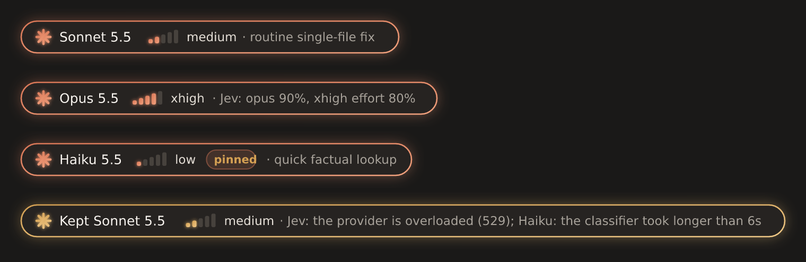
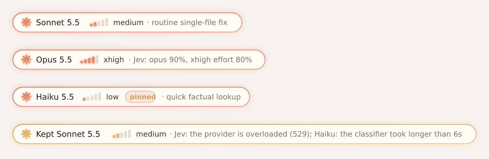

# model-router

A Claude Code plugin that chooses the model and effort level for each prompt you send.

- **Easy prompts** go to Haiku at low effort, so the answer comes back faster and uses less of your plan.
- **Everyday coding** goes to Sonnet.
- **Hard work** (architecture, cross-cutting changes, subtle bugs) goes to Opus at high effort.

**Every prompt** goes through it: typed ones, ones sent while Claude is working, and background-task messages.

The choice is made by a fast classifier, picked from the keys you have:

- **Jev** from TypeSafe AI, if you have a TypeSafe key.
- **OpenAI's Decisions API**, if you have an OpenAI key.
- Otherwise, **Claude Haiku 5.5 on your own Claude plan**, which needs no key.

Under each prompt, a small card shows what was picked and why. In VS Code and the desktop app it's a glowing pill with the Claude spark and an effort meter; in the terminal it's a rounded box in Claude's orange.




## Install

In Claude Code, type:

```
/plugin install model-router --marketplace <owner>/<repo>
```

Then:

1. Answer `y` to add the marketplace.
2. Press Enter to install at user scope.
3. Leave the settings as they are.

It starts working with your next prompt. To use Jev or OpenAI Decisions, run `/router keys` and paste your key.

## Choose a classifier

The default provider, `auto`, picks the classifier for you:

1. **Jev** if `TYPESAFE_API_KEY` is set.
2. Otherwise **OpenAI Decisions** if `OPENAI_API_KEY` is set.
3. Otherwise **Haiku on your Claude plan**.

If a classifier that uses a key fails (timeout, rejected key, outage), Haiku on your plan decides that prompt instead. Either way, every prompt is routed.

To force one, set /config → model-router → Classifier provider:

| Provider | What classifies | Key |
| --- | --- | --- |
| `auto` (default) | The best of the rows below that you have a key for | Any of the keys below, or none |
| `jev` | [Jev](https://docs.typesafe.ai) by TypeSafe AI, called directly at `https://api.typesafe.ai/v1/systemone`. A decision model that returns calibrated probabilities. | `TYPESAFE_API_KEY` |
| `openai-decisions` | [OpenAI Decisions API](https://developers.openai.com/api/docs/guides/decisions) at `https://api.openai.com/v1/decisions`, with `gpt-6-luna`. Currently in public beta. | `OPENAI_API_KEY` |
| `claude-plan` | Claude Haiku 5.5, through your Claude Code login | **None.** It counts against your plan like any other request. |
| `anthropic` | Claude Haiku 5.5 on your own Anthropic API key | `ANTHROPIC_API_KEY` |
| `openai` | `gpt-5-mini` with structured output | `OPENAI_API_KEY` |
| `openai-compatible` | Any OpenAI-style chat API. You must also set **Classifier base URL** and **Classifier model**. | `MODEL_ROUTER_API_KEY` |

### Add keys from Claude Code

Run `/router keys`. A pane opens with one row each for TypeSafe (Jev), OpenAI (Decisions) and Anthropic:

1. Paste a key into its field and press Enter.
2. The router saves the key and checks it right away with one small question. You'll see `✓ works · 380 ms` or the exact error, such as a rejected key or no access to the Decisions beta.
3. After saving, the pane shows only the key's last four characters (`••••1234`). **Check** tests the key again; **Remove** forgets it.

The same pane has a **Classifier** picker, so you can switch between `auto`, Jev, OpenAI Decisions or Haiku without opening /config.

Keys saved this way are stored in the plugin's own file in your Claude Code config folder on this computer. They are plain text, like the `env` block in `settings.json`, and never written to your project. A key saved here takes priority over environment variables. The field shows what you paste until you press Enter, so avoid pasting with your screen shared.

### Other ways to provide a key

- **In your shell profile**, for example `export TYPESAFE_API_KEY=...`. Then restart Claude Code.
- **In the `env` block of `~/.claude/settings.json`.** It's stored there as plain text.
- **On the install screen.** The key is kept in secure storage and isn't shown in /config. Under `auto`, the router recognizes it by its prefix: `sk-ant-…` is Anthropic, `sk-…` is OpenAI, and anything else is treated as TypeSafe.

## Use it

You don't need to do anything. Every prompt is routed:

- **The card** under your prompt shows the model, a five-step effort meter, and why. In VS Code or the desktop app, hover the card to see which classifier decided. An amber card means nothing could decide, so the previous pick was kept, and the card says why.
- **The status line** shows the current pick, for example `✻ Opus 5.5 · high`.

| Command | What it does |
| --- | --- |
| `/router` | Shows what the router is doing: last pick and why, provider, key source, pins |
| `/router test <prompt>` | Shows which model and effort a prompt would get, without sending it |
| `/router pin opus` | Always use Opus; the classifier still picks the effort |
| `/router pin high` | Always use high effort; the classifier still picks the model |
| `/router pin sonnet low` | Always use exactly this |
| `/router unpin` | Let the classifier decide again |
| `/router off` / `/router on` | Pause or resume routing |

**For one prompt only**, start it with the model or effort in brackets. The brackets are removed before Claude sees the prompt.

```
[opus] why does this deadlock only on Linux?
[high] review this diff
[haiku low] rename userId to accountId in this file
```

## How it decides

- **Tiers.** `haiku` handles lookups and mechanical edits. `sonnet` handles everyday coding with a clear path. `opus` handles hard, open-ended or high-stakes work. `fable` is for problems Opus would likely fail. Fable is off by default; set **Frontier tier model** to `claude-fable-5-1` to allow it.
- **Effort** runs from `low` to `max`, capped by **Highest effort allowed** (default `xhigh`).
- **Context.** Every classifier sees your prompt plus a short excerpt of the last few messages. A follow-up like "yes, do it" is rated by the task it continues, not by its own length.
- **Every prompt, every time.** Prompts you type, prompts sent while Claude is still working (the rest of that turn switches), and messages from background tasks or other sessions.
- **Decision models (Jev, OpenAI Decisions).** Each tier and each effort level is a choice question with a written description. The answer gives a probability for every option. The router then takes the cheapest tier that is at least 80% likely to be enough, and the lowest effort that is at least 70% likely to be enough. When the odds are spread out, this rounds up on its own.
- **Chat models (the other providers).** These follow a written rubric with worked examples and report their confidence. A low-confidence pick moves up one model.
- **Few model switches.** Changing model makes Claude re-read the conversation without the prompt cache. In a long conversation the router keeps the current model unless the new prompt is clearly easier or harder. Effort changes freely.
- **Main conversation only.** Subagents keep their own models.
- **Failures fall back.** If a keyed classifier is slow (over 6 s by default), down, refuses the prompt, or rejects the key, Haiku on your plan decides instead. Only if that fails too is the last pick kept, with an amber card saying why.

## Privacy and cost

For each prompt, the plugin sends the prompt text and a trimmed excerpt of recent messages to the provider you chose:

- **`claude-plan`** stays with Anthropic under your Claude Code login and uses a small amount of your plan.
- **`jev`** goes directly to TypeSafe, billed per input token with free output. TypeSafe's launch posts say Jev runs under zero data retention; check their terms.
- **`openai-decisions`** costs $0.10 per million input tokens, with no output charge. It's a public beta.
- **`anthropic`** with Haiku 5.5 costs roughly $0.0003 per prompt.

Classifying usually adds about a second or less before each turn starts. The decision APIs are designed to be faster than a chat model.

## Settings

Every setting lives in /config → model-router, except the API key:

| Setting | Default |
| --- | --- |
| Classifier provider | `auto` |
| Classifier API key | (empty: falls back to environment variables) |
| Classifier model | the provider's default |
| Classifier base URL | the provider's default |
| Fast / Everyday / Deep / Frontier tier model | `claude-haiku-5-5` / `claude-sonnet-5-5` / `claude-opus-5-5` / off |
| Highest effort allowed | `xhigh` |
| Show the routing card | on |
| Classifier timeout (ms) | 6000 |

- **To turn a tier off**, empty its model field. Example: clear the Deep tier to never use Opus.
- **On Bedrock, Vertex or a gateway**, set each tier model to the ID your provider uses (Bedrock IDs start with `anthropic.`).

## For a team

To have everyone who opens a repository offered the plugin, add this to that repository's `.claude/settings.json`:

```json
{
  "extraKnownMarketplaces": {
    "model-router": { "source": { "source": "github", "repo": "<owner>/<repo>" } }
  },
  "enabledPlugins": { "model-router@model-router": true }
}
```

With the default `auto` provider, nobody needs a key. People with a TypeSafe or OpenAI key get Jev or Decisions automatically.

## Develop

```
claude plugin validate .
claude plugin test .
claude --plugin-dir .
```

Built and tested on Claude Code 2.1.295.
